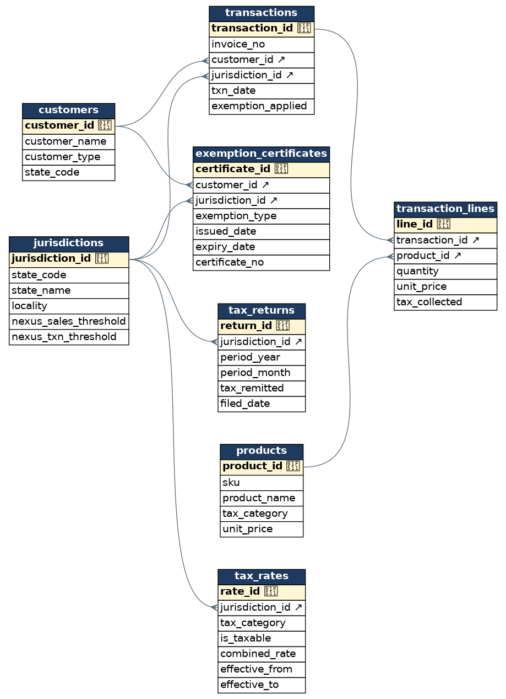

# Indirect Tax Compliance & Analytics — SQL Project

A portfolio SQL project that models how a company determines, validates, and
reconciles **U.S. sales & use tax** across multiple states — and uses SQL to
surface real compliance risk: under-collected tax, unsupported exemption
certificates, economic-nexus crossings, and return reconciliation gaps.

Built in **SQLite** (zero install — a single file database). Every query runs
as-is and has been verified end to end.

> Built to map directly to the EY *Indirect Tax Technology & Transformation*
> Senior role: designing databases, data acquisition/transformation, and tax
> data analytics & reporting.

---

## The business problem

A company sells goods and services into 5 states (CA, TX, NY, FL, WA). For every
sale it must answer three questions, correctly, every time:

1. **Determination** — Is this product taxable in the ship-to state, and at what
   rate (which changes over time)? Was the right amount of tax charged?
2. **Exemptions** — If the sale was treated as exempt (resale, nonprofit,
   government), is there a *valid, unexpired* certificate to support it? Missing
   or expired certificates are the #1 finding in a state audit.
3. **Nexus & remittance** — Has the company crossed a state's economic-nexus
   threshold (post-*Wayfair*) and must now register? Does tax *collected* on
   invoices tie to tax *remitted* on filed returns?

This project builds the database to answer all three with SQL.

---

## What's in the repo

| File | Purpose |
|------|---------|
| `01_schema.sql` | Database design: 8 tables + indexes + a reporting view, fully commented |
| `02_seed_data.sql` | Realistic FY2025 data with **intentional edge cases** so the analysis finds real issues |
| `03_analysis_queries.sql` | 20 analytical queries, each documented with its business purpose and the SQL skill it demonstrates |
| `run.py` | One-command runner: builds the DB and executes every query |
| `export_bi.py` | Exports Power BI / Tableau-ready CSVs to `bi_exports/` |
| `make_erd.py` | Regenerates the ERD diagram (`erd.png` / `erd.svg`) |
| `erd.png` | Entity-relationship diagram of the schema |
| `bi_exports/` | BI-ready CSV datasets (fact table, scorecard, nexus, exposure) |
| `RESUME_BULLET.md` | Ready-to-paste résumé bullets for this project |
| `README.md` | This file |

---

## How to run it

**Option A — Python (no install needed):**

```bash
python3 run.py
```

**Option B — SQLite CLI:**

```bash
sqlite3 tax.db < 01_schema.sql
sqlite3 tax.db < 02_seed_data.sql
sqlite3 tax.db < 03_analysis_queries.sql
```

---

## Data model



```
customers ──┐                        ┌── products
            │                        │
            ▼                        ▼
        transactions ──< transaction_lines
            │
            ▼
       jurisdictions ──< tax_rates           (effective-dated statutory rates)
            │   ▲
            │   └────────── exemption_certificates (customer + jurisdiction)
            ▼
        tax_returns        (tax remitted per state / period)
```

- **`jurisdictions`** — states with their economic-nexus thresholds (dollar and
  transaction-count rules differ by state).
- **`tax_rates`** — combined statutory rate by state × product category, **effective
  dated** (`effective_from` / `effective_to`) so a mid-year rate change is handled
  correctly.
- **`exemption_certificates`** — proof of exemption, with issue/expiry dates.
- **`transactions` / `transaction_lines`** — invoices and line items, storing the
  tax *actually* collected so it can be compared to the expected tax.
- **`tax_returns`** — what was remitted to each state per period.
- **`v_transaction_detail`** — a view that explodes each line and attaches the
  statutory rate in effect on the transaction date (used by most queries).

---

## Query tour (highlights)

The 20 queries progress from foundational reporting to advanced risk analytics.
A few worth calling out:

- **Q2 / Q3 — Tax determination engine.** Recomputes statutory tax per line and
  compares to what was charged, classifying every variance as under-collected
  (liability) or over-collected (refund risk).
- **Q4 / Q5 — Exemption audit.** Finds sales sold as exempt with **no certificate**
  or an **expired certificate**, then quantifies the tax exposure. *(Finds NY
  nonprofit on an expired cert and a WA reseller with none on file.)*
- **Q6 / Q7 — Economic nexus tracking.** Running totals by state (window
  functions) that flag exactly when and where the company crosses a nexus
  threshold and must register. *(Flags FL crossing $100k on 2025-05-20.)*
- **Q8 / Q19 — Reconciliation & scorecard.** Ties tax collected to tax remitted by
  period, surfacing short-remittances and unfiled returns, then rolls everything
  into a one-row-per-state executive scorecard.
- **Q15 — Effective-dated rate change.** Catches sales taxed at a superseded rate
  after CA's mid-year increase.
- **Q20 — Headline exposure.** A single labeled summary of total quantified risk.

---

## SQL techniques demonstrated

- Schema design with constraints, foreign keys, `CHECK`s, and indexes
- Reusable **views**
- **CTEs** (single and chained / multiple)
- **Window functions**: running totals (`SUM/COUNT OVER ... ORDER BY`),
  `ROW_NUMBER`, `RANK`, `LAG`, percent-of-total
- Conditional aggregation and **pivot** tables (`CASE` inside `SUM`/`MAX`)
- **Effective-dated joins** (point-in-time rate lookup)
- `LEFT JOIN` + `NULL` detection and `EXISTS` for risk/anti-pattern detection
- Date handling (`strftime`, `julianday`), `COALESCE`, `NULLIF`, rounding

---

## Verified results (sample)

Running against the seed data, the analytics correctly surface:

| Finding | Source query | Result |
|---|---|---|
| CA Aug sale under-collected after rate increase | Q3 | **$30** short |
| TX sale over-collected (wrong rate) | Q3 | **$36** over |
| Unsupported exempt sales (NY expired + WA missing cert) | Q5 | **$2,688** tax exposure |
| FL economic nexus crossed | Q7 | **2025-05-20** at $123,600 |
| WA Sept return not filed | Q8 | **$285** unremitted |

---

## BI-ready exports

Run `python3 export_bi.py` to generate CSVs in `bi_exports/` that drop straight
into Power BI or Tableau:

- `fact_transaction_detail.csv` — denormalized fact table (line, rate, expected
  tax, variance) — the main table for a BI model.
- `state_scorecard.csv` — one row per state for an executive dashboard.
- `nexus_tracking.csv` — running totals with a nexus-crossed flag.
- `exposure_summary.csv` — headline quantified-risk numbers.

## Possible extensions

- Add VAT/GST jurisdictions to model international indirect tax
- Build a stored procedure / parameterized tax-calc function
- Layer a BI dashboard (Power BI / Tableau) on top of the scorecard query
- Add use-tax (self-assessed) accrual logic on purchases
